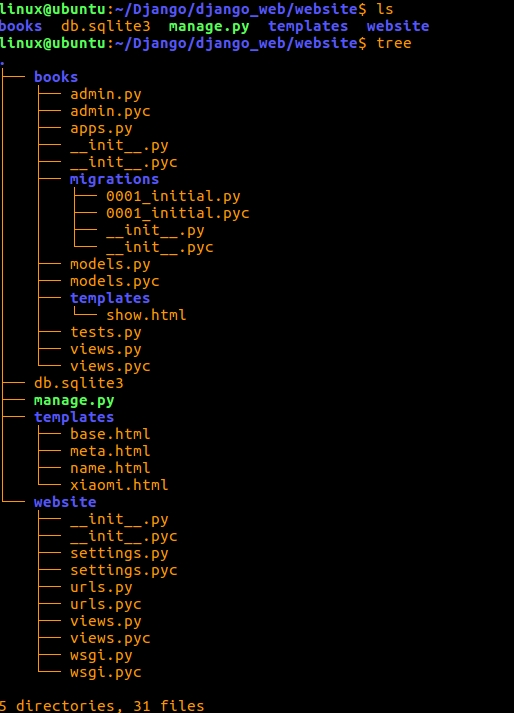
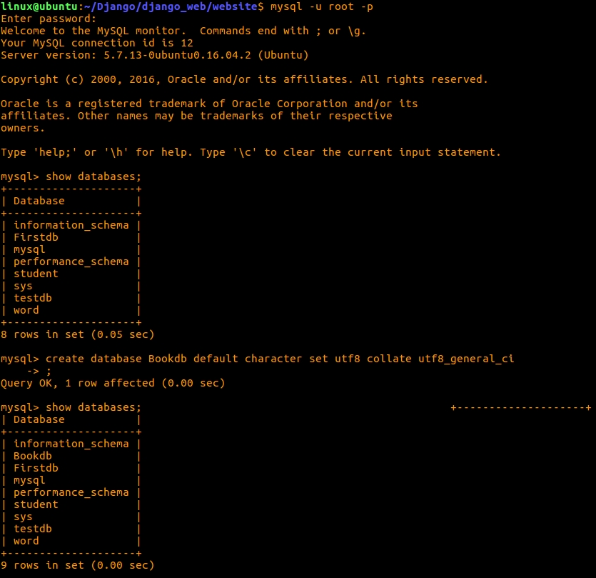
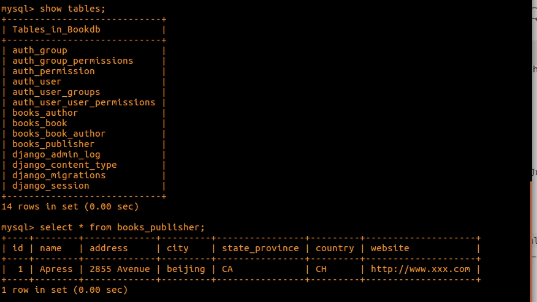

## 首先需要注意的是文件目录
 

 这里面的文件大致作用:
   
   - books这个 文件夹存放的是新建数据库的各种信息
   - books/templates这个目录下装的是网页的布局,当然这个网页的布局就是show.html所提供
   - books/views.py定义函数,并且把show.html引入进去,文件内容如下:
   
```
from django.shortcuts import render,render_to_response

from django.template import loader

from books import models

# Create your views here.

def show(request):
    # publisher_list = [{'name':"gongye",'city':'beijing'}]
    publisher_list = models.Publisher.objects.all()
    return render_to_response('show.html',{'publisher_list':publisher_list})

```
- books/models.py文件存放的是你所创建的数据库,代码如下:

```
#coding=utf-8
from __future__ import unicode_literals

from django.db import models

# Create your models here.

class Publisher(models.Model):
    name = models.CharField(max_length = 30)
    address = models.CharField(max_length = 50)
    city = models.CharField(max_length = 60)
    state_province = models.CharField(max_length = 30)
    country = models.CharField(max_length = 50)
    website = models.URLField()
# __unicode__这个函数用来返回某个值可以很好的用于查询和admin界面的显示
    def __unicode__(self):
        return self.name

class Author(models.Model):
    first_name = models.CharField(max_length = 30)
    last_name = models.CharField(max_length = 40)
    email = models.EmailField(blank = True,verbose_name = 'e-mail')
    def __unicode__(self):
        return u'%s %s'%(self.first_name,self.last_name)

class Book(models.Model):
    title = models.CharField(max_length = 100)
    author = models.ManyToManyField(Author)
    publisher = models.ForeignKey(Publisher)
    publication_date = models.DateField(blank = True,null = True)
    def __unicode__(self):
        return self.title

```

- books下其他的文件就是在创建的过程中自己产生的.

- website/templates文件里存放的是各种显示的静态网页布局,这么多html文件,只要你在访问测试的时候,端口号后面加上html的文件名字就行.比如,我要访问templates/base.html文件,输入网址:localhost:8000/base就可以.

- website/settings.py文件是Django的设置文档,里面的INSTALLED_APPS添加多个应用,比如这里面我九添加了books应用,代码如下:

```
INSTALLED_APPS = [
    'django.contrib.admin',
    'django.contrib.auth',
    'django.contrib.contenttypes',
    'django.contrib.sessions',
    'django.contrib.messages',
    'django.contrib.staticfiles',
    'books',
]
```

 增加模板文件夹,能够引入templates,代码如下:(同样都是在settings中修改)

```
TEMPLATES = [
    {
        'BACKEND': 'django.template.backends.django.DjangoTemplates',
        'DIRS': ['templates'],
        'APP_DIRS': True,
        'OPTIONS': {
            'context_processors': [
                'django.template.context_processors.debug',
                'django.template.context_processors.request',
                'django.contrib.auth.context_processors.auth',
                'django.contrib.messages.context_processors.messages',
            ],
        },
    },
]

```

- website/urls.py作用是引导url(资源管理器),代码如下:

```
#coding=utf-8
"""website URL Configuration

The `urlpatterns` list routes URLs to views. For more information please see:
    https://docs.djangoproject.com/en/1.9/topics/http/urls/
Examples:
Function views
    1. Add an import:  from my_app import views
    2. Add a URL to urlpatterns:  url(r'^$', views.home, name='home')
Class-based views
    1. Add an import:  from other_app.views import Home
    2. Add a URL to urlpatterns:  url(r'^$', Home.as_view(), name='home')
Including another URLconf
    1. Import the include() function: from django.conf.urls import url, include
    2. Add a URL to urlpatterns:  url(r'^blog/', include('blog.urls'))
"""
from django.conf.urls import *
from django.contrib import admin
from website.views import *

urlpatterns = patterns('website.views',
    url(r'^admin/', admin.site.urls),
    (r'^$','my_homepage_view'),
    (r'^hello/$','hello'),
    (r'^time/$','current_datetime'),#显示当前时间
    (r'^time/plus/(\d{1,2})/$','hour_ahead'),#显示几小时后的时间
    (r'xiaomi/$','xiaomi'),
    (r'name/$','name'),
    (r'meta/$','display_meta'),
    )

urlpatterns += patterns('books.views',
    url(r'^show/','show'),
    url(r'search_form/$','search_form'),
    url(r'search/$','search'),
)

```

### 注意: urls.py与views.py文件是对应的,在views.py中定义函数,一定要添加到urls.py中去.

- website/views.py文件是定义各种函数,便于使用,代码如下:

```
#coding=utf-8

from django.http import HttpResponse
import datetime

from django.template import loader
from django.shortcuts import render,render_to_response

def hello(request):
    return HttpResponse("Hello World")

def my_homepage_view(request):
    return HttpResponse("你好")

def current_datetime(request):
    now = datetime.datetime.now()
    html = "<html><body>It is now %s.</body></html>"%now
    return HttpResponse(html)

def hour_ahead(request,offset): #定义函数，这个函数名在urls.py文件中必须存在
    offset = int(offset)
    dt = datetime.datetime.now() + datetime.timedelta(hours = offset)
    html = "<html><body>In %s hour(s),it will be %s.</body></html>"%(offset,dt)
    return HttpResponse(html)

def xiaomi(request):
    t = loader.get_template("xiaomi.html")
    html = t.render({})
    return HttpResponse(html)

d = {'name':'zhangsan','age':'15'}  #可以引入字典
l = ['zhangsan','14']  #引入列表

#定义变量
class A:
    age = 11
a = A()

#定义函数
def fun():
    return "hello"

def name(request):

    today = 1 #1代表判断正确，输出结果；0代表错误，不输出结果
    #name_list = ['zhangsan','lisi','wangwu','zhanba']
    name_list = []

    t = loader.get_template("name.html")
    #html = t.render({'name':'zhangjianwei'}) #直接加入值
    #html = t.render({'name':fun})  #引用函数
    html = t.render({'name':fun,'today_is_weekend':today,'athlete_list':name_list})
    return HttpResponse(html)

def display_meta(request):
    values = request.META.items()
    values.sort()
    html= []
    path = request.path
    for (k,v) in values:
        html.append((k,v))
    return render_to_response('meta.html',{'meta_data':html,'request_path':path})

```

### 操作数据库使用到的命令:

- `mysql -u root -p`连接用户名为root的数据库

- `show databases`显示数据库

- `create database Bookdb default character set utf8 collate utf8_general_ci;`创建一个Bookdb数据库并设置utf-8编码 

- `use Bookdb;`使用Bookdb数据库

- `show tables;`显示数据库里的存在的项目名

- `select * from books_publisher;`查询books_publisher数据库里的数据

 命令如图所示:
 


 

***

